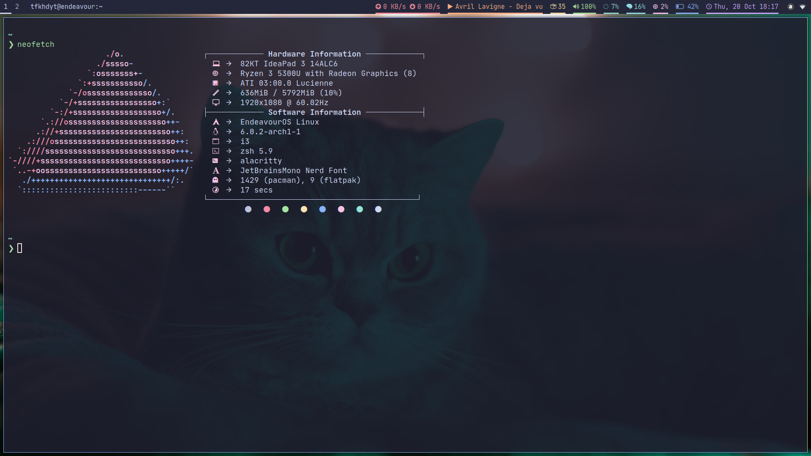

# TFKHDYT's dotfiles

  

🐧 My Linux desktop dotfiles 🐧

## Features

- Aliases
- Environment Variable
- .zshrc
- .gitconfig
- disable mouse accel
- .imwheelrc
- .xinputwatcher
- Program-specific config:
  - Alacritty
  - Bottom
  - Dunst
  - Firefox
  - i3
  - libinput-gesture
  - Macchina
  - MangoHUD
  - mpv
  - Neofetch
  - nvim (NvChad)
  - openrazer
  - Picom
  - Polybar
  - Polychromatic
  - Rofi
  - Starship
  - yt-dlp
- fontconfig (emoji)
- systemd user services:
  - imwheel
  - playertctld
  - xinputwatcher
  - eos-update-notifier
