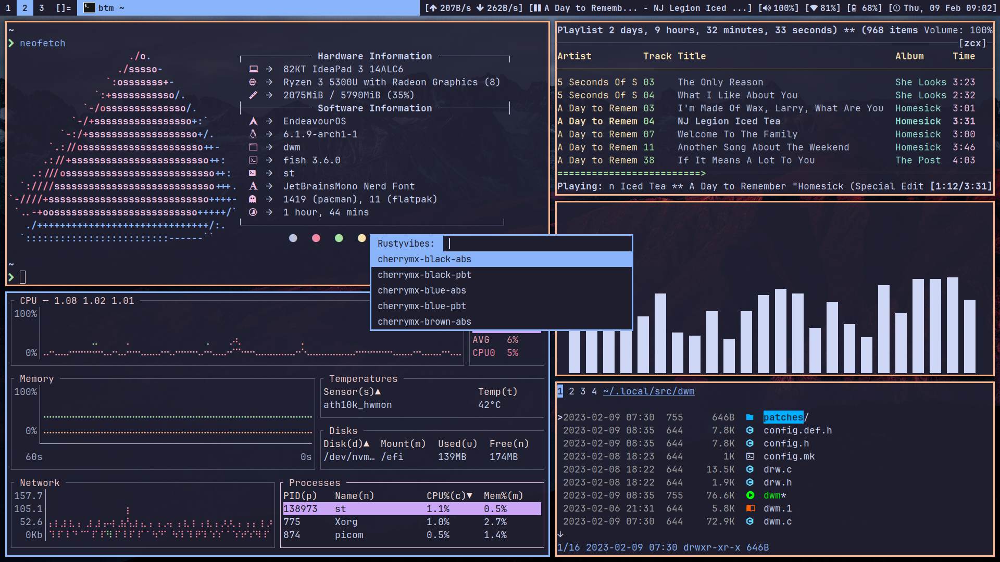

# TFKHDYT's dotfiles

  

🐧 My Linux desktop dotfiles 🐧

## Features

- Alacritty
  - Theme: Catppuccin Mocha
- tmux
  - Theme: Catppuccin Mocha
  - Mouse: enabled
  - 256 color support
  - Prefix: `Ctrl + a`
  - Plugins:
    - tmux plugin manager (tpm)
    - tmux sensible
    - tmux yank
      - yank selection mouse: clipboard
- newsboat
  - Theme: Catppuccin Mocha
  - Default browser: LibreWolf
  - Macro:
    - open youtube video in mpv
  - Vim keybinding
  - Auto reload
  - Reload threads: 8
  - Feed sort order: title
- mpv
  - Subtitle:
    - Lang:
      1. Indonesia
      2. English (Fallback)
    - Font: Liberation Sans
    - Border size: 2
    - Font size: 40
  - Save position on quit
  - Screenshot directory: `/home/tfkhdyt/Pictures/Screenshots/mpv/`
  - Scripts:
    - Sponsorblock
- bat
  - Theme: Catppuccin Mocha
- Neofetch
  - Theme: insert name
- Neovim
  - Theme: Catppuccin Mocha
  - Base config: LazyVim
  - User-installed plugins:
    - Neorg
    - nvim-colorizer
    - wakatime
    - Codeium
- fish
  - Plugins:
    - Autopair
  - Theme: Catppuccin Mocha
  - Environment Variables
  - Aliases
  - Abbreviations
  - Git Prompt
- ncmpcpp
  - Audio visualizer
- Dunst
  - Theme: Catppuccin Mocha
  - Progress bar
  - Font: JetBrainsMono Nerd Font
  - Icon: Papirus Dark
- Picom
  - Dual kawase blur
  - Fade
  - Shadow
  - Vsync
- mpd
  - Pipewire
  - Auto update
  - Audio visualizer
- bottom
  - Theme: Catppuccin Mocha
- MangoHud
  - cpu_temp
  - gpu_temp
  - gpu_core_clock
  - gpu_mem_clock
  - ram
  - vram
  - cpu_mhz
  - frametime
  - gamemode
  - background_alpha=0.5
  - benchmark_percentiles=97,AVG,1,0.1
- Zathura
  - Use system clipboard
- Work in progress...
